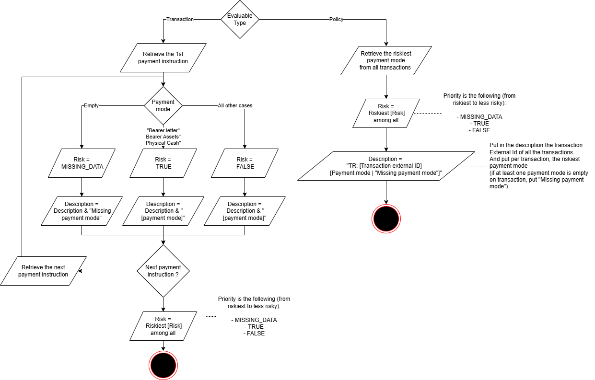

# class-test

## Test for the computation of the Payment Instruction risk :

Implement the computation method for the following schema :

The Class to modify to implement the computation is : 
src/main/java/com/lombardinternational/classtest/springdata/computation/PaymentInstructionComputationService.java

The test class to check if everything is correct is :
src/test/java/com/lombardinternational/classtest/computation/PaymentInstructionComputationServiceTest.java
